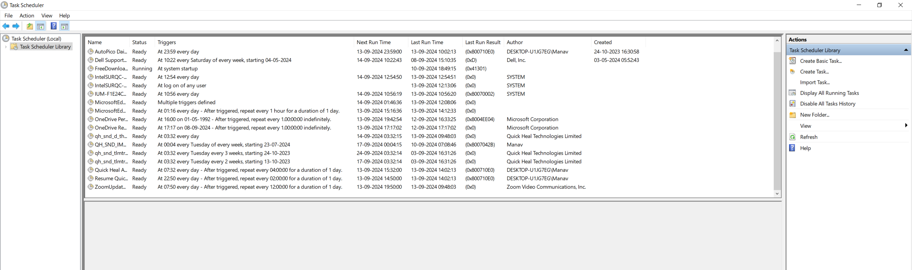
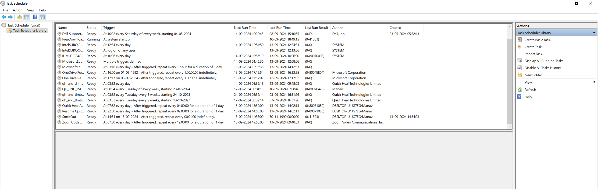

# Automated Folder Organiser
The average downloads folder is always messy and This script helps schedule a task in windows where in the task scheduler is used and batch files are run to create and delete the task to organise downloads folder.

Before schedule.bat is executed:

After execution (as administrator):

Note: You will need to add the path to the SortItOut.py in the schedule.bat batch file.